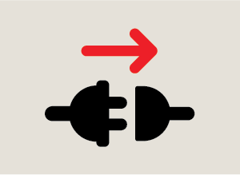

# Align Transmitter & Receiver

**Étape 1:** Allumez l'ouvre-porte. La position de la porte n'est pas encore définie.  
   
<figure><figcaption>
Allumez l'ouvre-porte pour aligner le faisceau
</figcaption></figure>  
   
**Étape 2:** Les LED clignoteront sur TOUTES les parties pour indiquer une connexion Bluetooth réussie. Le clignotement s'arrête après 30 secondes.  
   
<figure><figcaption>
Le clignotement de la LED indique une connexion Bluetooth réussie
</figcaption></figure>  
   
**Étape 3:** Vérifiez l'état d'alignement.  
   
<figure><figcaption>
La LED ROUGE fixe indique que le faisceau est aligné
</figcaption></figure>  
   
Lorsque la LED ROUGE du récepteur est allumée, le faisceau est correctement aligné.  
   
Lorsque la LED ROUGE du récepteur est éteinte, le faisceau n'est pas correctement aligné.  
   
<figure><figcaption>
Aucune LED ROUGE n'indique que le faisceau n'est pas aligné
</figcaption></figure>  
   
**Étape 4:** Alignez l'émetteur et le récepteur  
   
Pendant le processus d'alignement, la fonction d'alignement du faisceau de l'ouvre-porte offre un guide grâce à sa lumière principale (la lumière de courtoisie) et son avertisseur sonore.  
   
<figure><figcaption>
Ensemble, la lumière de courtoisie (principale) de l'ouvre-porte et l'avertisseur sonore indiquent l'alignement du faisceau / l'état de blocage
</figcaption></figure>  
   
Pour aligner le faisceau de sécurité, desserrez l'écrou à oreilles à l'arrière de l'unité émettrice ou réceptrice et ajustez jusqu'à ce que l'ouvre-porte signale l'alignement (voir ci-dessus).  
   
<figure><figcaption>
Avec l'écrou à oreilles arrière desserré, ajustez l'unité émettrice ou réceptrice dans la direction des flèches
</figcaption></figure>
