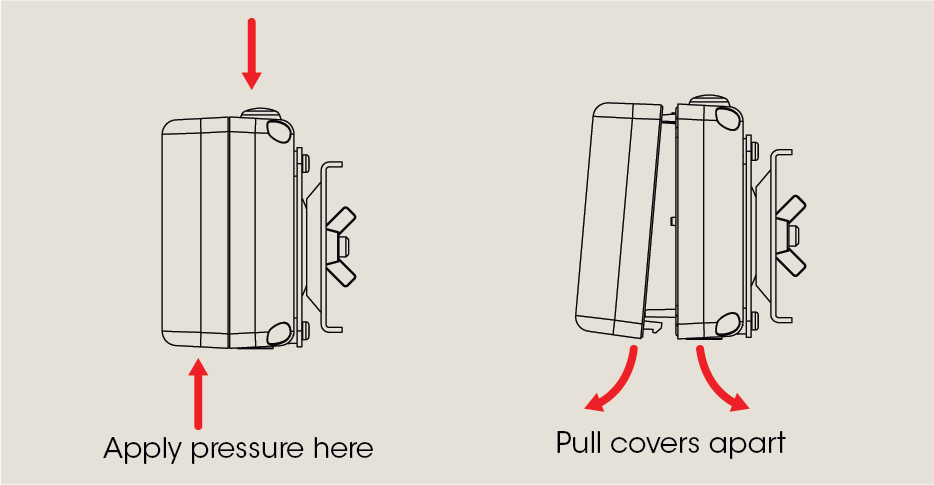
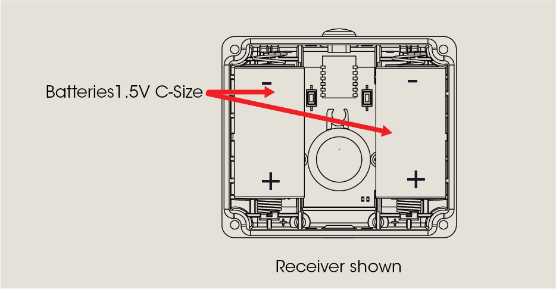

# Insert / Replace Batteries

Lors de l'installation, insérez les piles dans les unités émettrice et réceptrice avant de monter les supports.  
   
Chaque unité nécessite 2 piles de type C de 1,5 volts (fournies avec le kit).  
   
#### Ouvrir les couvercles  
   
<figure><figcaption></figcaption></figure>  
   
&#x20;  
   
#### Insérer les piles dans chaque unité  
   
  
Après avoir remplacé les piles, testez le faisceau pour vous assurer de l'alignement.  
  
   
<figure><figcaption></figcaption></figure>
