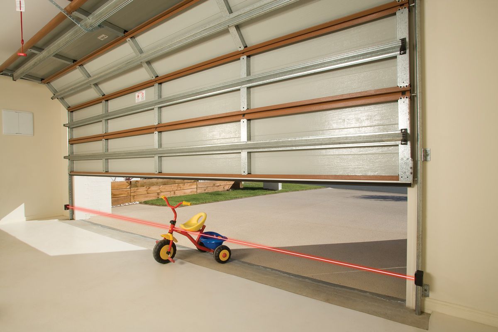

# Aperçu

<figure><figcaption>
Aide à prévenir la fermeture accidentelle de votre porte automatique ou de votre volet lorsqu'elle est obstruée par des personnes, des animaux domestiques ou des objets.
</figcaption></figure>


Lorsque vous consultez sur un appareil mobile, pour une navigation détaillée, cliquez sur l'icône du menu (en haut à gauche).

Si vous ne trouvez pas ce que vous cherchez, cliquez sur l'icône de la loupe pour rechercher dans l'ensemble du manuel (en haut à droite).



[do-you-need-a-safety-beam.md](do-you-need-a-safety-beam.md)



[power-and-wiring-requirements.md](power-and-wiring-requirements.md)



[beam-placement-requirements.md](beam-placement-requirements.md)



[device-compatibility.md](device-compatibility.md)

