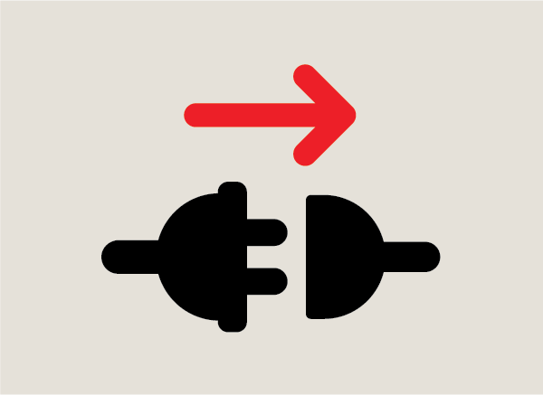

# Disconnect Safety Beam

#### Étape 1: Débrancher l'ouvre-porte de l'alimentation électrique  
   
<figure><figcaption></figcaption></figure>  
   
#### Étape 2: Retirer la station de base du faisceau de sécurité de l'ouvre-porte  
   
<figure><figcaption></figcaption></figure>  
   
#### Étape 3: Rebrancher l'ouvre-porte à l'alimentation électrique  
   
<figure><figcaption></figcaption></figure>  
   
#### Étape 4: Re-scanner les accessoires  
   
  
Après avoir retiré le faisceau de sécurité, l'ouvre-porte ne fonctionnera pas tant que vous n'aurez pas re-scanné les accessoires, même s'il n'y a pas d'autres accessoires installés.  

